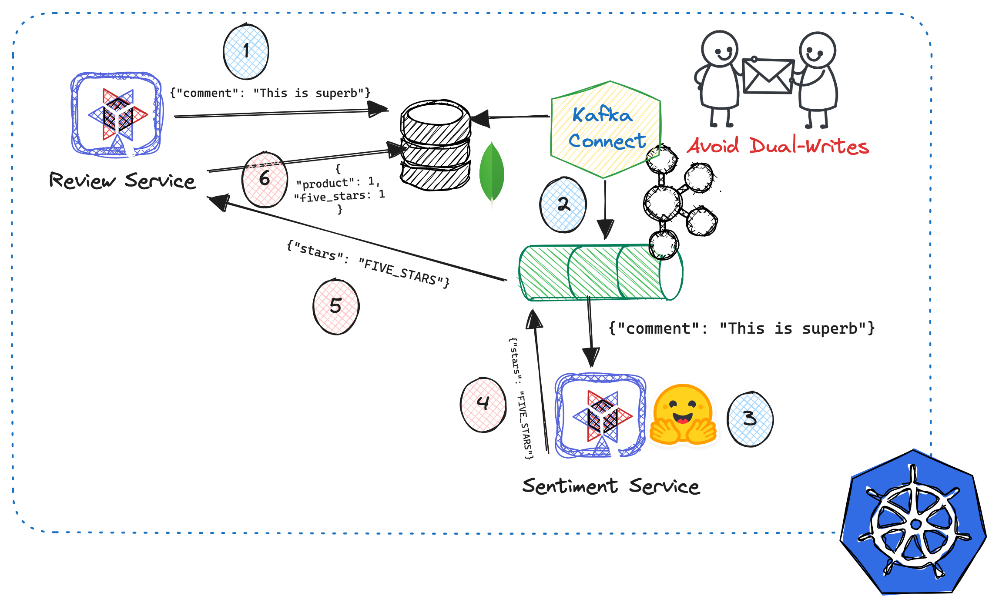

= Event-Driven AI

This is the typical sentiment AI example, but Kafka and Debezium are used instead of synchronous calls.

The sentiment analysis example analyzes a comment made on a product, analyzes the sentiment, and rates it from 1 to 5 stars.

In terms of architecture, there are two services: one that manages the product reviews and another that contains the HuggingFace model for analyzing the content.

Kafka and Debezium indirectly manage the communication between both services, which is the correct way to avoid the double-writes problem.

Debezium reacts to this event (Change Data Capture) when a new comment is stored in the MongoDB database and places the data into a Kafka topic.

Then, the sentiment service gets the event, processes it, and sends it to another topic.

Finally, the first service consumes the event and updates the stars counter.

The following schema summarizes the architecture:

== Deploying

This example works in any Kubernetes cluster; in the `deployment` directory, you can find the manifests ordered by execution.

The only specific manifest is the `10_openshift_routes.yaml` that creates the OpenShift routes to access the service.

Moreover, if you don't want to execute all the manifests individually, the `deploy_openshift.sh` script is provided to manage all at once.

=== Red Hat Developer Sandbox

This example works on https://developers.redhat.com/developer-sandbox[Red Hat Developer Sandbox], with free access to a shared OpenShift and Kubernetes cluster.

After you are registered, run the `oc login` in a terminal window, and then the script will deploy the solution.

=== Kafka UI

Apart from the solution, Kafka UI is deployed so you can access Kafka topics visually.

=== REST API

This solution doesn't come with a frontend; it offers two important endpoints to interact with the solution:

[source, bash]
----
// Returns the information of the products with the comments and the ratings

curl "$reviewUrl/productsWithComments" 

// Generates a random comment to a random product

curl "$reviewUrl/review/generate"
----

=== Clean Up

There are shell scripts to undeploy the solution.
These scripts are `clean_kubernetes.sh` and `clean_openshift.sh`.